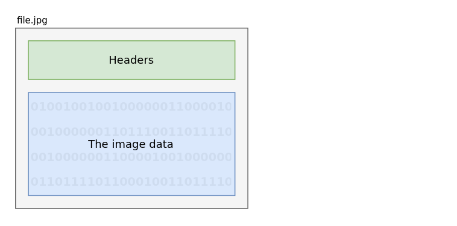
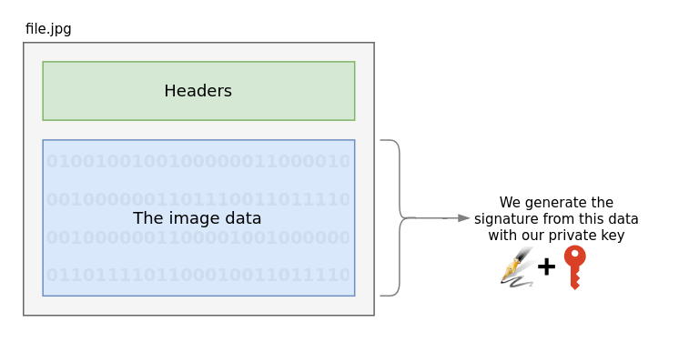
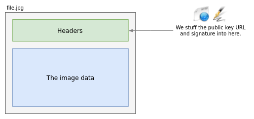
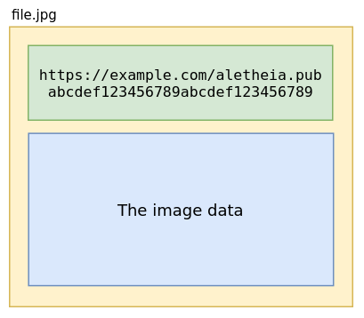
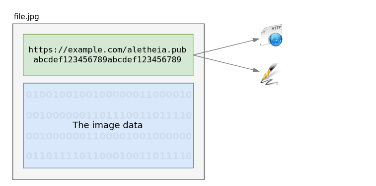
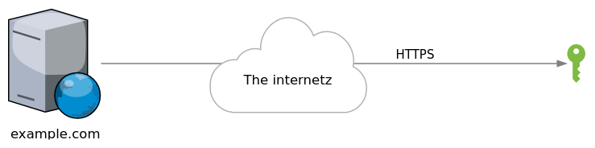

# Aletheia

[](https://pypi.org/project/aletheia/)

Fight fake news with cryptography & human nature

Just as journalism has taken a critical financial hit, fake news is multiplying
across social networks faster than facts. The public doesn't know which stories
are real any more because anyone with a laptop can forge audio & video in
record time. We need to empower the institutions we trust with the ability to
tie their reputations to the journalism they produce.

Aletheia uses cryptographic signatures + DNS to leverage existing networks of
human trust in individual journalists & institutions to help link those people
to the work they produce with a view to change our expectations of what
constitutes journalism: if it's not verified, it's just some stranger on the
internet.

To this end, Aletheia combines cryptographic signatures with human nature's
concept of social trust.  It helps you sign all the files you produce so that
they can later be verified as coming from you.  At that point, math has
guaranteed the file's origin, it's only our personal (or professional)
reputations that can be called into question.

This is further outlined in this [blog post](https://danielquinn.org/blog/public-key-authentication-for-media-files-why-isnt-this-a-thing/)
on the subject.  This project is inspired by this [Radiolab story](http://futureoffakenews.com/videos.html)
covering how surprisingly easy it is to create believable audio & video fakes.


## Visuals


### Signing

This is a typical file

<p align="center"></p>

Aletheia uses your private key to sign the relevant portion of the file:

<p align="center"></p>

That signature is inserted into the file header, along with the URL for the
public key:

<p align="center"></p>

The final result is a slightly larger file, now with a means of verifying its
origin.

<p align="center"></p>


### Verification

When it comes time to verify the file, you need only extract the public key
URL:

<p align="center"></p>

...and fetch that key from the creator's site:

<p align="center"></p>

Finally, we use this public key to verify the file:

<p align="center"></p>

---

Aletheia will do all of this for you in two commands: `sign`, and `verify`.

If you'd like to get started, you can [install Aletheia from PyPi now](https://pypi.org/project/aletheia/).
If however you're looking for a more technical explanation, keep reading.


## A technical explanation

The process is relatively simple: source organisations & individuals can
publish their public key somewhere on the internet and use their private key to
sign the media they distribute.  Social networks and individuals can then
reference this signature to verify the origin.


### Generate a private & public key

Generating a private & public key is necessary for the signing & verification
process, but this only needs to be run once.

```bash
$ aletheia generate
Generating private/public key pair...

All finished!

You now have two files: aletheia.pem (your private key) and
aletheia.pub (your public key).  Keep the former private, and share
the latter far-and-wide.  Importantly, place your public key at a
publicly accessible URL so that when you sign a file with your
private key, it can be verified by reading the public key at that
URL.
```


### Sign a file

```bash
$ aletheia sign file.jpg example.com
```

Here, the `aletheia` program:

1. Gets the image data (sans metadata)
2. Generates a signature by combining it with our private key
3. Converts the signature to text
4. Writes the new signature to the file along with the location of our public
   key.


### Verifying a file

```bash
$ aletheia verify file.jpg
```

Much like signing, `aletheia` is doing all the work for you:

1. It extracts the signature & URL from the file
2. Fetches the public key from the URL & caches it
3. Attempts to verify the signature on the file with said public key.


## Project Status

Aletheia is working, and ready to be deployed on sites running Python, or ones
happy to use the Python-based command-line script.  In order for it to be
widely adopted however, more needs to be done.  Here's what we have so far:


### Ready

We now have a working [Python library](https://pypi.org/project/aletheia/) that
can generate keys as well as support the following file formats:


### Images

<table style="margin: 0 auto;">
   <tr>
      <th>Format</th>
      <th>Supported</th>
      <th>Notes</th>
   </tr>
   <tr>
      <th colspan="3">Images</th>
   </tr>
   <tr>
      <td>JPEG</td>
      <td align="center">👍</td>
      <td>Requires <a href="https://sno.phy.queensu.ca/~phil/exiftool/">Exiftool</a></td>
   </tr>
   <tr>
      <td>GIF</td>
      <td align="center">👍</td>
      <td>Requires <a href="https://sno.phy.queensu.ca/~phil/exiftool/">Exiftool</a></td>
   </tr>
   <tr>
      <td>PNG</td>
      <td align="center">👍</td>
      <td>Requires <a href="https://sno.phy.queensu.ca/~phil/exiftool/">Exiftool</a></td>
   </tr>
   <tr>
      <th colspan="3">Audio</th>
   </tr>
   <tr>
      <td>MP3</td>
      <td align="center">👍</td>
      <td>Requires <a href="https://ffmpeg.org/">FFmpeg</a></td>
   </tr>
   <tr>
      <th colspan="3">Video</th>
   </tr>
   <tr>
      <td>MKV</td>
      <td align="center">👍</td>
      <td>Requires <a href="https://ffmpeg.org/">FFmpeg</a></td>
   </tr>
   <tr>
      <td>WEBM</td>
      <td align="center">👍</td>
      <td>Requires <a href="https://ffmpeg.org/">FFmpeg</a></td>
   </tr>
   <tr>
      <td>MP4</td>
      <td align="center">👍</td>
      <td>Requires <a href="https://ffmpeg.org/">FFmpeg</a></td>
   </tr>
   <tr>
      <td>AV1</td>
      <td align="center">❌</td>
      <td></td>
   </tr>
   <tr>
      <th colspan="3">Other</th>
   </tr>
   <tr>
      <td>HTML</td>
      <td align="center">👍</td>
      <td></td>
   </tr>
   <tr>
      <td>Markdown</td>
      <td align="center">👍</td>
      <td></td>
   </tr>
   <tr>
      <td>ReStructuredText</td>
      <td align="center">❌</td>
      <td></td>
   </tr>
   <tr>
      <td>PDF</td>
      <td align="center">❌</td>
      <td></td>
   </tr>
   <tr>
      <td>GZ</td>
      <td align="center">❌</td>
      <td></td>
   </tr>
   <tr>
      <td>BZ2</td>
      <td align="center">❌</td>
      <td></td>
   </tr>
   <tr>
      <td>XZ</td>
      <td align="center">❌</td>
      <td></td>
   </tr>
</table>


### Help Wanted


#### Support for additional formats.

The lowest-hanging fruit are finished, so now the priorities are the other
popular web formats like `pdf`, `gz`, and maybe `av1` -- assuming these
formats have a metadata layer into which we can include a signature.


#### Porting the Python library to additional languages

Python is great, but it's not for everyone.  Ideally, it would great if
developers in languages like Ruby, Javascript, PHP, Java, Rust, Clojure, Go,
and C# could use Aletheia in their chosen environment.
